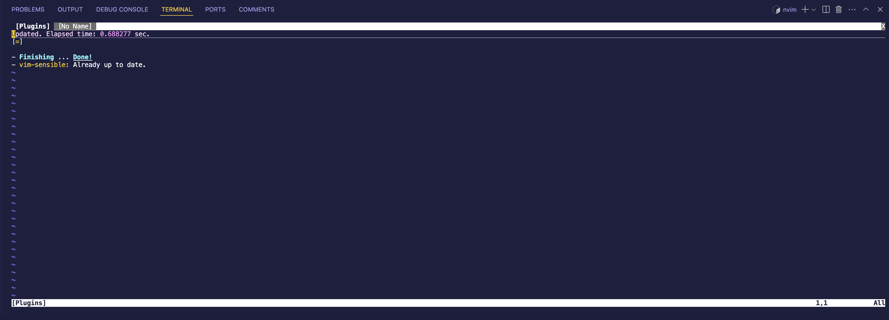

# Getting Started with Neovim

> **Language:** [Español](README.md) | **English**

Hello developer 👋🏻! In this repo you have everything you need to try Neovim inside Visual Studio Code using Dev Containers 🤓 So you don't need to install Neovim on your local machine if you don't want to. If you want to know more about Dev Containers you can check out this video from my YouTube channel:


## How to start Neovim

1. Open this repo in Visual Studio Code.
2. Open the command palette (Ctrl + Shift + P) and select `Dev Containers: Reopen in Container`.
3. Wait for the container to be created
4. Open the terminal and run the following command:

```bash
nvim
```
5. Done! You now have Neovim running inside a Docker container. You can start using it as you would normally.

## How to install Github Copilot in Neovim

To install Github Copilot in Neovim, you first need to install the `github/copilot.vim` plugin. You can use a plugin manager like `vim-plug` or `packer.nvim` to do this. If you don't have any installed, you can do it easily:

### With `vim-plug`

To install this plugin manager you can run the following command in the terminal:

```bash
curl -fLo ~/.local/share/nvim/site/autoload/plug.vim --create-dirs \
    https://raw.githubusercontent.com/junegunn/vim-plug/master/plug.vim 
```

Then, the next thing you need to do is create the following file:

```bash
code ~/.config/nvim/init.vim
```

Inside it you can add the following code to install plugins:

```vim
call plug#begin()

" List your plugins here
Plug 'tpope/vim-sensible'

call plug#end()
```

Now you can open Neovim


```bash
nvim
```

and run the following command to install the plugins:

```bash
:PlugInstall
```

And you'll see something like this:



Ok, perfect, now you can add the Github Copilot plugin to your plugin list. To do this, add the following line inside `call plug#begin()` and `call plug#end()`:

```vim
Plug 'github/copilot.vim'
```

```bash
code ~/.config/nvim/init.vim
```

Close Neovim and reopen it.

```bash
nvim
```

Now run the following command to install the plugins:

```bash
:PlugInstall
```

And you'll see something like this:


Now, to be able to use Github Copilot in Neovim, you need to authenticate. To do this, run the following command:

```bash
:Copilot setup
```

Now try opening a file with Neovim and start typing:

```bash
nvim app.js
```

### Other cool plugins for Neovim

- [nvim-treesitter]: A plugin that provides syntax highlighting and code analysis for various programming languages.
- [nvim-lspconfig]: A plugin that provides easy-to-use configuration for the Language Server Protocol (LSP) in Neovim.
- [nvim-compe]: An autocompletion plugin for Neovim that works with LSP and other autocompletion sources.
