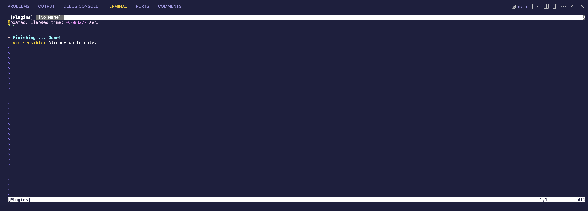

# Cómo empezar con Neovim

¡Hola developer 👋🏻! En este repo tienes todo lo que necesitas para probar Neovim, dentro de Visual Studio Code usando Dev Containers 🤓 Por lo que no necesitas instalar Neovim en tu máquina local si no quieres. Si quieres saber más sobre Dev Containers puedes echar un vistazo a este vídeo de mi canal de YouTube:


## Cómo arrancar Neovim

1. Abre este repo en Visual Studio Code.
2. Abre la paleta de comandos (Ctrl + Shift + P) y selecciona `Dev Containers: Reopen in Container`.
3. Espera a que se cree el contenedor
4. Abre el terminal y ejecuta el siguiente comando:

```bash
nvim
```
5. ¡Listo! Ya tienes Neovim corriendo dentro de un contenedor de Docker. Puedes empezar a usarlo como lo harías normalmente.

## Cómo instalar Github Copilot en Neovim

Para poder instalar Github Copilot en Neovim, primero necesitas instalar el plugin `github/copilot.vim`. Puedes usar un gestor de plugins como `vim-plug` o `
packer.nvim` para hacerlo. Si no tienes instalado ninguno puedes hacerlo de forma sencilla:

### Con `vim-plug`

Para instalar este gestor de plugins puedes ejecutar el siguiente comando en el terminal:

```bash
curl -fLo ~/.local/share/nvim/site/autoload/plug.vim --create-dirs \
    https://raw.githubusercontent.com/junegunn/vim-plug/master/plug.vim 
```

Luego, lo siguiente que tienes que hacer es crear el siguiente archivo:

```bash
code ~/.config/nvim/init.vim
```

Dentro de él puedes añadir el siguiente código para instalar plugins:

```vim
call plug#begin()

" List your plugins here
Plug 'tpope/vim-sensible'

call plug#end()
```

Ahora puedes abrir Neovim y ejecutar el siguiente comando para instalar los plugins:

```bash
:PlugInstall
```

Y verás algo como esto:



Ok, perfecto, ahora puedes añadir el plugin de Github Copilot a tu lista de plugins. Para ello, añade la siguiente línea dentro de `call plug#begin()` y `call plug#end()`:

```vim
Plug 'github/copilot.vim'
```

```bash
code ~/.config/nvim/init.vim
```

Cierra Neovim y vuelve a abrirlo. Ahora ejecuta el siguiente comando para instalar los plugins:

```bash
:PlugInstall
```

Y verás algo como esto:


Ahora, para poder usar Github Copilot en Neovim, necesitas autenticarte. Para ello, ejecuta el siguiente comando:

```bash
:Copilot setup
```

### Otros plugins chulos para Neovim

- [nvim-treesitter]: Un plugin que proporciona resaltado de sintaxis y análisis de código para varios lenguajes de programación.
- [nvim-lspconfig]: Un plugin que proporciona una configuración fácil de usar para el Language Server Protocol (LSP) en Neovim.
- [nvim-compe]: Un plugin de autocompletado para Neovim que funciona con LSP y otros orígenes de autocompletado.

